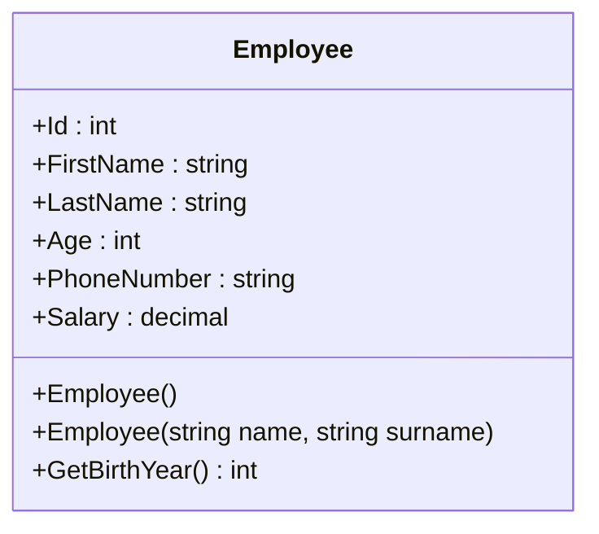

### Task 1

### Section 1

Create a class named `Employee` according to scheme :


---

### Section 2

Create list of employees in `Program.cs`. Add 3 different instances of `Employee` to the list.  

```csharp
var employees = new List<Employee>()
{
    new Employee()
    {
        Id = 1,
        FirstName = "Alijon",
        LastName = "Zabirov",
        Age = 24, 
        PhoneNumber = "881667007",
        Salary = 4000
    },
    new Employee()
    {
        Id = 2,
        FirstName = "Nurullo",
        LastName = "Sulaymonov",
        Age = 30, 
        PhoneNumber = "908765432",
        Salary = 8000
    },
    new Employee()
    {
        Id = 3,
        FirstName = "Shodmon",
        LastName = "Inoyatzoda",
        Age = 26, 
        PhoneNumber = "987009988",
        Salary = 7800
    },
};

```
---

### Section 3

Create new list. Add 2 more instances to `employees`. Use `AddRange()` method. 

Создать новый список. Добавьте еще 2 экземпляра в `employees`. Используйте метод `AddRange()`.

---

### Section 4

Sort `employees` list in ascending order by salary. Use `OrderBy()` method.

Отсортируйте список сотрудников по возрастанию зарплаты. Используйте метод `OrderBy()`.

---

### Section 5

Remove all employees with age smaller than `25`. Use `RemoveAll()` method.

Удалите всех сотрудников младше `25` лет. Используйте метод `RemoveAll()`.

---

### Section 6

Find all employees with salary greater than `5000`. Use `FindAll()` method.

Найдите всех сотрудников с зарплатой более `5000`. Используйте метод `FindAll()`.

---

### Section 7

Find employee with `Id` of 3 from `employees` and remove it from list. Use `FirstOrDefault()` and `Remove()` method.

Найдите сотрудника с идентификатором 3 среди сотрудников и удалите его из списка. Используйте методы `FirstOrDefault()` и `Remove()`.

---

### Section 8

Find employee with name `Jura` if employee does not exists insert it to the index 1. Use `Exists()` and `Insert()` method. 

Найдите сотрудника с именем `Jura`, если сотрудник не существует, вставьте его в индекс 1. Используйте методы `Exists()` и `Insert()`.

---

### Section 9

Create new list of employees. Add three instances of `Employee` and insert the list to `employees` list. Use `InsertRange()` mehtod.

Создайте новый список сотрудников. Добавьте три экземпляра `Employee` и вставьте список в список `employees`. Используйте метод `InsertRange()`.

--- 

### Section 10

Sort list `employees` in descending order. Use `OrderByDesc()` method.

Отсортируйте список `employees` по убыванию. Используйте метод `OrderByDesc()`.
